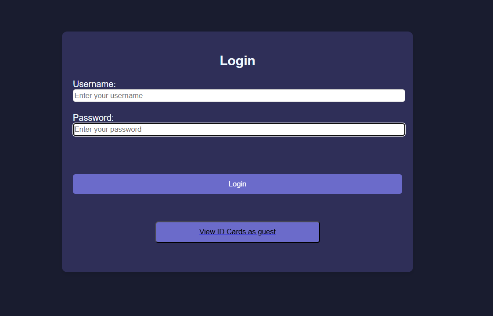
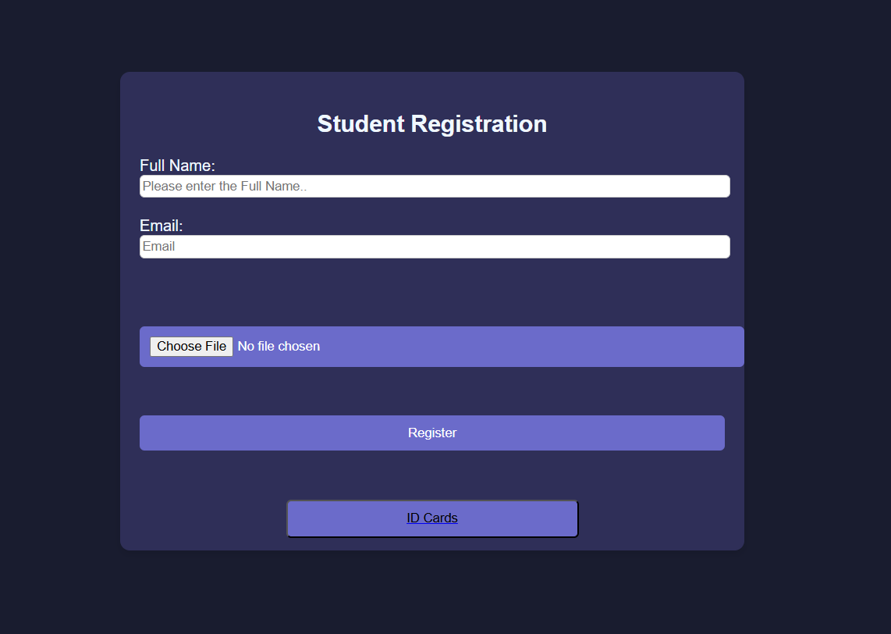

# **Student ID Card Management System**

This project is a web-based application for managing student information and generating ID cards. It allows users to register students, upload their photos, and view their information in a user-friendly interface.

## **Features**
- **Student Registration**: Register students by entering their name, email, and uploading a photo.
- **ID Card Display**: Dynamically display student details as ID cards with photos.
- **Authentication System**: Login functionality for admin and guest access to view ID cards.
- **Responsive Design**: Simple and clean user interface with a responsive design.

## **Getting Started**

### **Prerequisites**
- A web server (e.g., XAMPP, WAMP, or LAMP)
- PHP 7.4 or higher
- MySQL 5.7 or higher
- A modern web browser

### **Setup Instructions**

1. **Clone the Repository**:
   ```bash
   git clone https://github.com/yourusername/student-id-card-system.git
   cd student-id-card-system
   ```

2. **Create the MySQL Database**:
   - Open your MySQL client or phpMyAdmin.
   - Create a database named `school_database`:
     ```sql
     CREATE DATABASE school_database;
     ```

3. **Import the Database Schema**:
   - Locate the `school_database.sql` file in the repository.
   - Import the file into the `school_database`:
     ```bash
     mysql -u root -p school_database < path/to/school_database.sql
     ```

4. **Configure Database Connection**:
   - Open the `fetch_students.php` and `process.php` files.
   - Update the database connection settings if needed:
     ```php
     $servername = "localhost";
     $username = "root";
     $password = "";
     $database = "school_database";
     ```

5. **Set Up the File Uploads Directory**:
   - Create a directory named `uploads` in the project root.
   - Ensure the directory has write permissions:
     ```bash
     mkdir uploads
     chmod 755 uploads
     ```

6. **Run the Project**:
   - Place the project folder in your server's root directory (e.g., `htdocs` for XAMPP).
   - Start the server and navigate to:
     ```
     http://localhost/student-id-card-system/
     ```

## **Usage**

- **Admin Login**: 
  - Username: `admin`
  - Password: `password`
- **Guest Access**: View ID cards without logging in by clicking "View ID Cards as Guest."

## **File Structure**
- `index.html`: Login page
- `students.html`: Display page for student ID cards
- `process.php`: Handles student registration and file uploads
- `fetch_students.php`: Fetches student data from the database
- `login_process.php`: Validates admin login
- `uploads/`: Directory to store uploaded photos
- `school_database.sql`: Database schema

## **Technologies Used**
- Frontend: HTML, CSS, JavaScript
- Backend: PHP
- Database: MySQL

## **Screenshots**




## **Contributing**
Contributions are welcome! Please fork the repository and create a pull request with your changes.

## **License**
This project is licensed under the MIT License.
